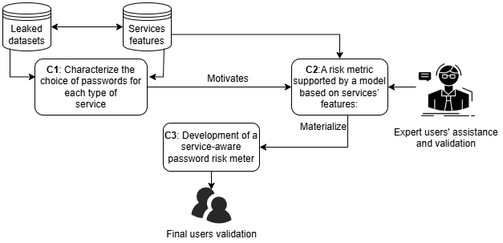

# Supplementary Materials for  
**Service-aware password risk meter – Helping users to choose suitable passwords in services**

**Authors:**  
Roi Sánchez Serna [[ORCID: 0009-0001-6424-8262]](https://orcid.org/0009-0001-6424-8262)  
Ana I. González-Tablas [[ORCID: 2222-3333-4444-5555]](https://orcid.org/2222-3333-4444-5555)  
Lorena González Manzano [[ORCID: 1111-2222-3333-4444]](https://orcid.org/1111-2222-3333-4444)  
Jose María de Fuentes [[ORCID: 2222-3333-4444-5555]](https://orcid.org/2222-3333-4444-5555)  

**Affiliation:**  
Universidad Carlos III de Madrid  
Av. de la Universidad, 30, 28911 Leganés, Madrid, Spain  

**Contact:**  
roisan@uc3m.pa.es, aigonzal@inf.uc3m.es, lgmanzan@inf.uc3m.es, jfuentes@inf.uc3m.es  

---

## Overview

This repository includes supplementary materials for the article:  
**"Service-aware password risk meter – Helping users to choose suitable passwords in services"**  
(submitted to ARES 2025)

Due to space constraints in the main manuscript, additional figures, tables, and materials are provided here to complement the study and support reproducibility.

---

## Approach Overview

The following figure provides a schematic summary of our proposed model. It illustrates how user, password, and service features are integrated to assess risk and generate feedback through the password meter interface.

---

## Analyzed Password Leaks

The table below lists the datasets analyzed in our study, grouped by service category. Each entry includes the date of the breach (if known), the number of leaked passwords, and a summary of relevant password metrics. Services marked with an asterisk (*) indicate that the associated password policy was retrieved from 2024 documentation if no historical data was available.

<table>
    <tr>
        <td><strong>Category</strong></td>
        <td><strong>Service</strong></td>
        <td><strong>Date</strong></td>
        <td><strong># Passwords</strong></td>
        <td><strong>Mean Length</strong></td>
        <td><strong>Min Length</strong></td>
        <td><strong>Mask</strong></td>
        <td><strong>Mean Score</strong></td>
    </tr>
    <tr>
        <td>Business</td>
        <td>Kickstarter *</td>
        <td>16/02/2014</td>
        <td>1,456,977</td>
        <td>8.11</td>
        <td>6</td>
        <td>l</td>
        <td>1.38</td>
    </tr>
    <tr>
        <td></td>
        <td>Cashcrate</td>
        <td>17/11/2016</td>
        <td>6,038,126</td>
        <td>8.46</td>
        <td>6</td>
        <td>l</td>
        <td>1.56</td>
    </tr>
    <tr>
        <td></td>
        <td>Myheritage *</td>
        <td>26/10/2017</td>
        <td>81,618,257</td>
        <td>7.01</td>
        <td>9</td>
        <td>l</td>
        <td>1.14</td>
    </tr>
    <tr>
        <td></td>
        <td>Booking *</td>
        <td>01/12/2018</td>
        <td>129,949</td>
        <td>10.24</td>
        <td>10</td>
        <td>lud</td>
        <td>2.48</td>
    </tr>
    <tr>
        <td></td>
        <td>Clearvoicesurveys</td>
        <td>01/10/2019</td>
        <td>12,283,514</td>
        <td>9.19</td>
        <td>8</td>
        <td>l</td>
        <td>2.25</td>
    </tr>
    <tr>
        <td></td>
        <td>Gigasize</td>
        <td>Unknown</td>
        <td>1,896,399</td>
        <td>7.84</td>
        <td>-</td>
        <td>-</td>
        <td>1.44</td>
    </tr>
    <tr>
        <td></td>
        <td>Hq</td>
        <td>Unknown</td>
        <td>3,025,218</td>
        <td>9.53</td>
        <td>-</td>
        <td>-</td>
        <td>2.17</td>
    </tr>
    <tr>
        <td>Digitaltool</td>
        <td>Dropbox *</td>
        <td>01/07/2012</td>
        <td>50,000</td>
        <td>9.14</td>
        <td>8</td>
        <td>luds</td>
        <td>1.88</td>
    </tr>
    <tr>
        <td></td>
        <td>Psiho</td>
        <td>01/03/2018</td>
        <td>883,693</td>
        <td>7.87</td>
        <td>-</td>
        <td>-</td>
        <td>1.30</td>
    </tr>
    <tr>
        <td></td>
        <td>Chegg *</td>
        <td>28/04/2018</td>
        <td>29,309,993</td>
        <td>9.09</td>
        <td>6</td>
        <td>lud</td>
        <td>1.92</td>
    </tr>
    <tr>
        <td></td>
        <td>Sharethis *</td>
        <td>09/07/2018</td>
        <td>2,268,955</td>
        <td>7.90</td>
        <td>8</td>
        <td>luds</td>
        <td>1.50</td>
    </tr>
    <tr>
        <td></td>
        <td>Canva *</td>
        <td>24/05/2019</td>
        <td>4,779,956</td>
        <td>9.19</td>
        <td>8</td>
        <td>l</td>
        <td>1.95</td>
    </tr>
    <tr>
        <td></td>
        <td>Mixfiend *</td>
        <td>Unknown</td>
        <td>193,984</td>
        <td>7.23</td>
        <td>6</td>
        <td>l</td>
        <td>1.20</td>
    </tr>
    <tr>
        <td>Games</td>
        <td>Evony</td>
        <td>01/06/2016</td>
        <td>34,147,326</td>
        <td>7.98</td>
        <td>-</td>
        <td>-</td>
        <td>1.38</td>
    </tr>
    <tr>
        <td></td>
        <td>Zynga *</td>
        <td>01/09/2019</td>
        <td>50,000</td>
        <td>9.12</td>
        <td>7</td>
        <td>l</td>
        <td>1.60</td>
    </tr>
    <tr>
        <td></td>
        <td>Gogames *</td>
        <td>Unknown</td>
        <td>1,207,367</td>
        <td>8.51</td>
        <td>8</td>
        <td>l</td>
        <td>1.41</td>
    </tr>
    <tr>
        <td></td>
        <td>Lekoolgames</td>
        <td>Unknown</td>
        <td>3,175,293</td>
        <td>8.49</td>
        <td>-</td>
        <td>-</td>
        <td>1.59</td>
    </tr>
    <tr>
        <td>Shopping</td>
        <td>Shein *</td>
        <td>01/06/2018</td>
        <td>28,951,772</td>
        <td>8.46</td>
        <td>8</td>
        <td>l</td>
        <td>1.68</td>
    </tr>
    <tr>
        <td></td>
        <td>Hautelook *</td>
        <td>07/08/2018</td>
        <td>13,047,077</td>
        <td>8.20</td>
        <td>8</td>
        <td>lud</td>
        <td>1.43</td>
    </tr>
    <tr>
        <td>Social</td>
        <td>Myspace</td>
        <td>01/07/2008</td>
        <td>50,000</td>
        <td>10.13</td>
        <td>6</td>
        <td>luds</td>
        <td>2.05</td>
    </tr>
    <tr>
        <td></td>
        <td>Linkedin</td>
        <td>05/05/2012</td>
        <td>67,241,910</td>
        <td>7.73</td>
        <td>6</td>
        <td>l</td>
        <td>1.28</td>
    </tr>
    <tr>
        <td></td>
        <td>Mate1</td>
        <td>29/02/2016</td>
        <td>27,401,746</td>
        <td>7.98</td>
        <td>6</td>
        <td>l</td>
        <td>1.35</td>
    </tr>
    <tr>
        <td></td>
        <td>Edmodo</td>
        <td>01/05/2017</td>
        <td>14,884,412</td>
        <td>8.81</td>
        <td>-</td>
        <td>-</td>
        <td>1.76</td>
    </tr>
    <tr>
        <td></td>
        <td>Dubshmash</td>
        <td>01/12/2018</td>
        <td>22,077,067</td>
        <td>7.55</td>
        <td>5</td>
        <td>l</td>
        <td>0.92</td>
    </tr>
    <tr>
        <td></td>
        <td>Htcmania</td>
        <td>04/01/2020</td>
        <td>482,910</td>
        <td>8.25</td>
        <td>1</td>
        <td>l</td>
        <td>1.61</td>
    </tr>
    <tr>
        <td></td>
        <td></td>
        <td><strong>Total</strong></td>
        <td>356,651,901</td>
        <td>8.48</td>
        <td></td>
        <td></td>
    </tr>
</table>

<em>* Policy data taken from 2024 if earlier policy unavailable.</em>

---

## Use Cases

This section will include detailed tables describing specific use cases examined to evaluate the behavior of users and the effectiveness of the proposed meter under realistic service conditions.

<!-- Placeholder for use case tables -->
_Use case tables will be added here._

---

## Survey Questions

This section provides the full text of the user and expert surveys employed in the study. These questionnaires were used to evaluate the usability and perceived value of the password risk meter.

<!-- Placeholder for survey questions -->
_Survey content will be added here._

---

## Citation

If you use or reference this material, please cite the original paper as:

> Sánchez Serna, R., González-Tablas, A.I., González Manzano, L., de Fuentes, J.M.  
> *Service-aware password risk meter – Helping users to choose suitable passwords in services*.  
> Submitted to ARES 2025.

---

## License

Unless otherwise stated, all materials are made available for academic and non-commercial use under the [Creative Commons Attribution 4.0 International License (CC BY 4.0)](https://creativecommons.org/licenses/by/4.0/).
